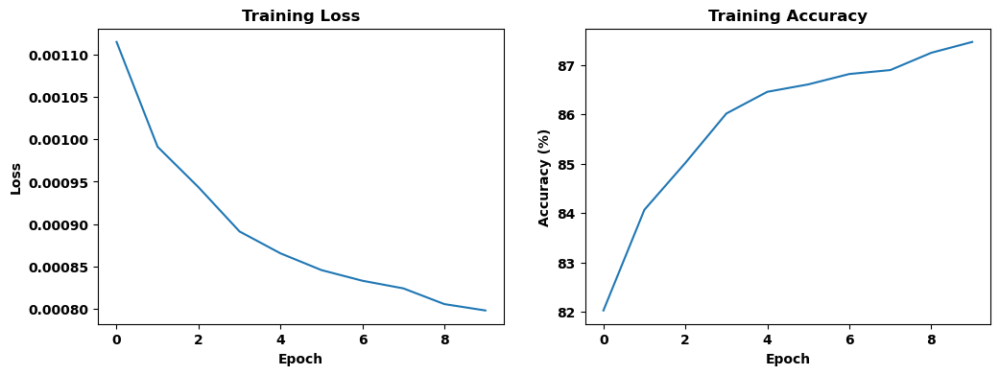
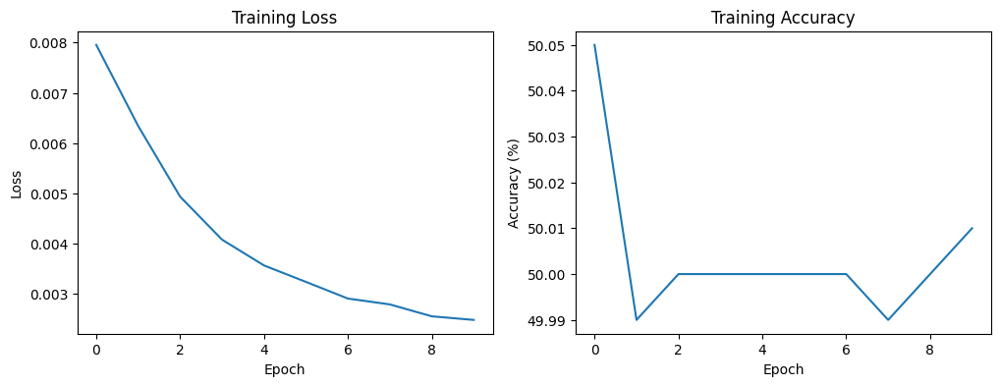
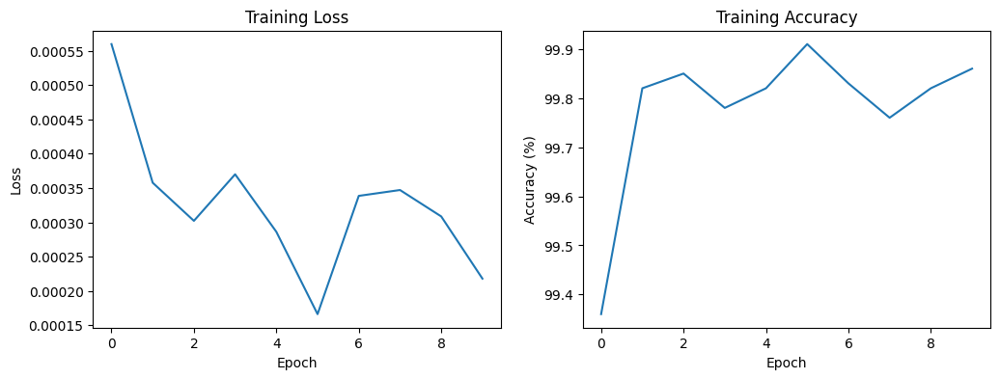
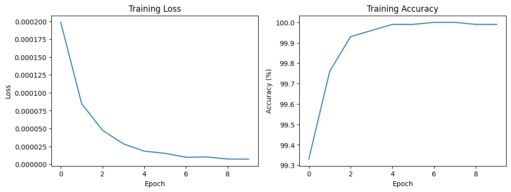

# Triplet Loss and Cross-Entropy Training on Binary CIFAR-10

This folder contains three PyTorch notebooks that train an ImageNet-pretrained ResNet-50 from `torchvision` to tell airplanes from automobiles, the first two classes of CIFAR-10. `Binary_Classifier.ipynb` freezes the network and trains only a new 2-output final layer with cross-entropy loss. `Triplet_Loss_Feature_Extractor.ipynb` first fine-tunes the backbone with a triplet margin loss on its 2048-dimensional features, using an anchor, a random image of the same class, and a random image of the other class, and then freezes the backbone and trains the final layer with cross-entropy. `Triplet_Loss_And_Feature_Extraction.ipynb` trains the whole network with the sum of a triplet loss and a cross-entropy loss, both computed on the 2-dimensional output. Every training stage runs for 10 epochs with SGD (learning rate 0.001, momentum 0.9), and each notebook plots the training loss and accuracy and reports the accuracy on the training and test sets.

## Results
Fine-tuning the backbone gives a higher test accuracy than training only the final layer on frozen features. The two-stage triplet-loss model reaches 97.00% on the test set, the jointly trained model 95.80%, and the frozen-backbone classifier 87.70%.

| Notebook | Training | Training accuracy | Test accuracy |
|---|---|---|---|
| `Binary_Classifier.ipynb` | Final layer only, cross-entropy | 87.45% | 87.70% |
| `Triplet_Loss_Feature_Extractor.ipynb` | Backbone with triplet loss, then final layer with cross-entropy | 99.81% | 97.00% |
| `Triplet_Loss_And_Feature_Extraction.ipynb` | Whole network, triplet loss plus cross-entropy | 99.99% | 95.80% |

In the two triplet-loss notebooks, the training images are scaled to [0, 1] while the test images are normalized to [-1, 1], so their test accuracies are measured on differently preprocessed inputs. The printed losses are divided by the number of images instead of the number of batches, so they are smaller than the average batch loss by a factor equal to the batch size.

### Frozen ResNet-50 with a new final layer
The training accuracy rises from 82.03% in the first epoch to 87.47% in the tenth.

#### Training loss and accuracy of the final layer on frozen ResNet-50 features

### Two-stage training with triplet loss
In the first stage, the triplet loss decreases in every epoch, while the logged accuracy stays between 49.99% and 50.05%. In the second stage, the final layer trained on the fine-tuned features classifies more than 99% of the training images correctly from the first epoch on.

#### Stage 1: triplet loss and accuracy of the frozen final layer
The accuracy comes from the untrained final layer, which is frozen in this stage, so it does not measure the quality of the features.

#### Stage 2: loss and accuracy of the final layer trained with cross-entropy

### Joint triplet and cross-entropy training
The training accuracy starts at 99.33% in the first epoch and reaches 100.00% in epochs 7 and 8.

#### Training loss and accuracy with the joint loss

