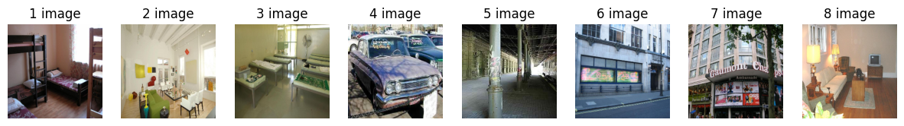
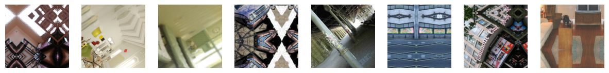

# Detecting Rotation, Displacement, and Scaling in Image Pairs

This notebook trains a two-stream convolutional network in PyTorch to recognize which geometric transformations were applied to an image. Each example pairs a 224 × 224 image from the ADE20K scene-parsing dataset with a copy transformed by one, two, or all three of rotation, displacement, and scaling, with the uncovered areas filled by reflection; the label is the combination of transformations, one-hot encoded over 8 classes. Both images pass through a shared stem and four shared residual stages, and feature-exchange modules swap every second column of the feature maps after the second stage and every second channel after the third and fourth stages. A fully connected head with a softmax output classifies the concatenated and average-pooled features, and the model is trained with binary cross-entropy and Adam. The notebook reports the loss and accuracy on the training, validation, and test sets and breaks the validation accuracy down by the number of transformations.

## Results
The run resumes from a checkpoint of earlier training and trains for 10 more epochs. In the last epoch, the training accuracy is 73.72% and the validation accuracy is 68.15%, after a peak of 69.25% in epoch 8, and the test accuracy is 67.33%. The model stays in training mode during validation and testing, so dropout is active when these accuracies are measured. Pairs with two transformations are recognized much less often than pairs with one or three.

| Transformations in the pair | Validation pairs | Accuracy |
|---|---|---|
| 1 | 645 | 77.83% |
| 2 | 704 | 47.87% |
| 3 | 651 | 81.41% |

#### Eight training images

#### The same eight images after random rotation, displacement, and scaling

