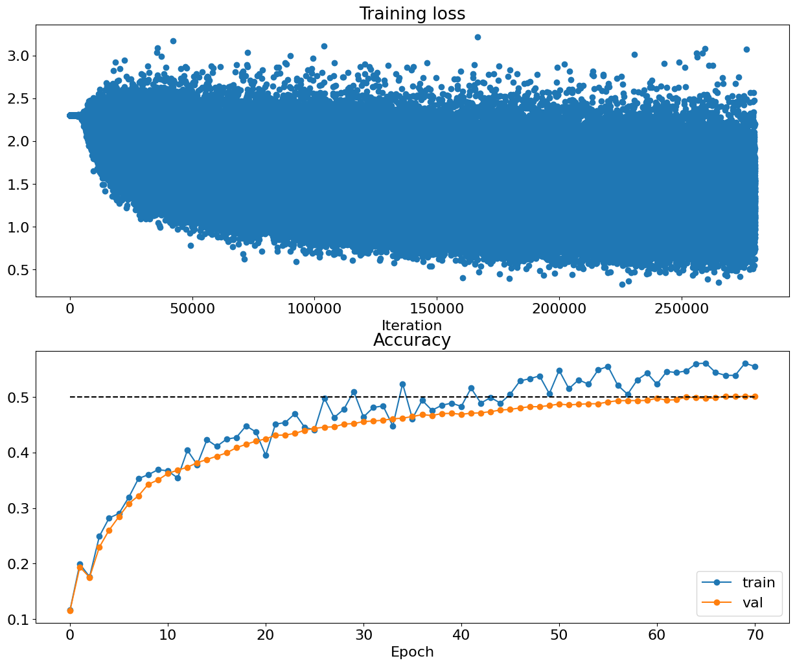
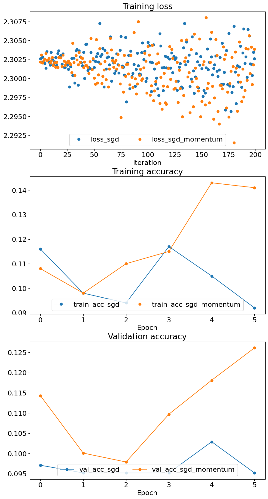
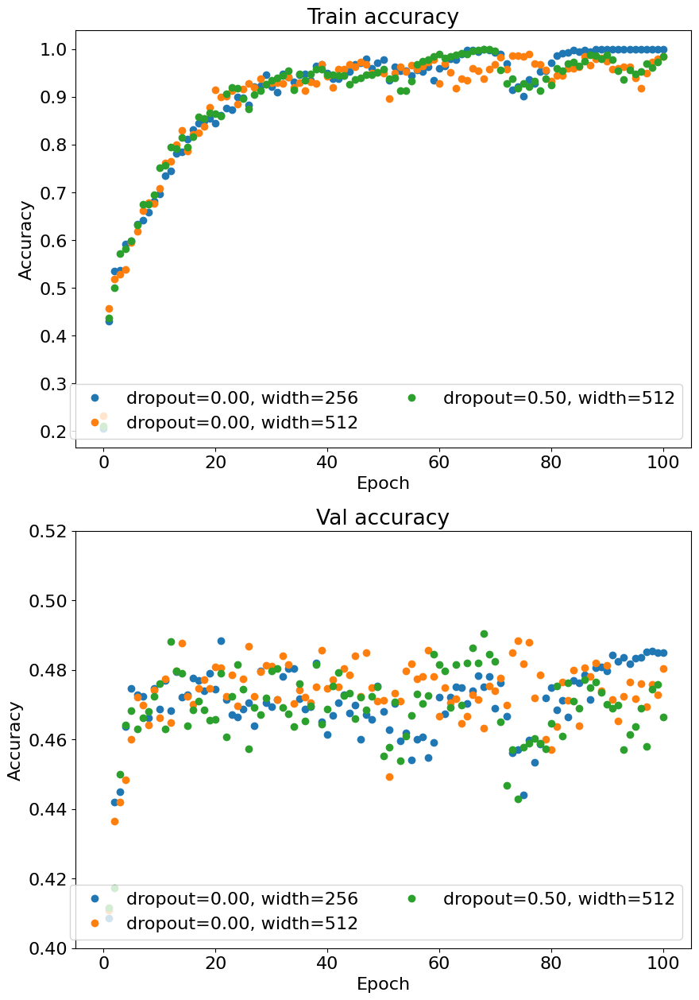

# Fully Connected Networks and Dropout on CIFAR-10

This notebook trains fully connected networks for CIFAR-10 image classification, built in PyTorch from modular layers with explicit forward and backward passes. The layers, the softmax loss, the models `TwoLayerNet` and `FullyConnectedNet`, and the update rules are imported from `fully_connected_networks.py`, and the data, gradient-checking, and training utilities come from a `libs` package; neither is included in this repository. The notebook checks each layer and update rule against reference values and numeric gradients, trains a two-layer network on 40,000 training images, and overfits a three-layer and a five-layer network on 50 images. It then compares SGD, SGD with momentum, RMSProp, and Adam on a network with five hidden layers, and trains networks with one hidden layer with and without dropout.

## Results

### Component checks
Most checks report relative errors below 3e-6. The `sgd_momentum` check reports a velocity error of 0.05, which is exactly the error of the unchanged input velocity, so the function does not store its updated velocity. The gradient check of `FullyConnectedNet` with regularization strength 3.14 reports relative errors of 1.00 for `W1` and `W2`.

### Two-layer network
The two-layer network returned by `create_solver_instance` reaches a validation accuracy of 50.17% after 70 epochs, and the saved and reloaded model gives the same 50.17%.

#### Training loss and accuracy of the two-layer network
The dashed line marks 50% accuracy.

### Overfitting 50 images
The three-layer network reaches 100% training accuracy on the 50 images after 17 epochs and the five-layer network after 8 epochs, while their validation accuracy stays at 12.69% and 11.74%. The first logged losses of both runs are infinite.

### Update rules
With learning rate 0.05, neither SGD nor SGD with momentum gets far above chance level after 5 epochs. Because `sgd_momentum` does not store its velocity, the velocity is not carried from one step to the next. The Adam and RMSProp runs were executed after the dropout experiment, so they trained on 20,000 images instead of 4,000, and they are not directly comparable with the SGD runs. The accuracies below are from the last epoch.

| Update rule | Learning rate | Training images | Training accuracy | Validation accuracy |
|---|---|---|---|---|
| SGD | 0.05 | 4,000 | 9.20% | 9.52% |
| SGD with momentum | 0.05 | 4,000 | 14.10% | 12.61% |
| RMSProp | 0.0001 | 20,000 | 37.30% | 36.67% |
| Adam | 0.001 | 20,000 | 53.30% | 46.21% |

#### Loss and accuracy of SGD and SGD with momentum

### Dropout
All three networks fit the 20,000 training images almost perfectly, and dropout does not improve the validation accuracy in this run. The accuracies below are from epoch 100.

| Hidden units | Dropout | Training accuracy | Validation accuracy |
|---|---|---|---|
| 256 | 0 | 100.00% | 48.50% |
| 512 | 0 | 98.40% | 48.05% |
| 512 | 0.5 | 98.50% | 46.65% |

#### Training and validation accuracy with and without dropout
The validation panel shows accuracies between 0.40 and 0.52.

