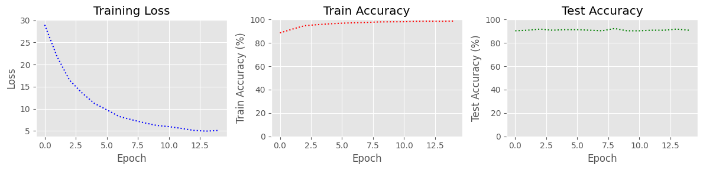
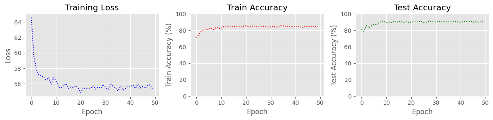
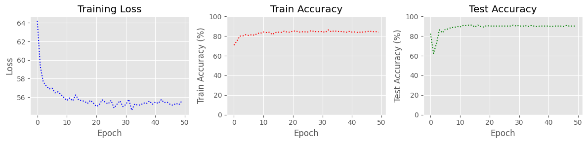
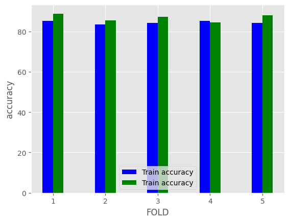

# Fully Connected, LSTM, and Bidirectional LSTM Models on BBBP

This notebook compares three PyTorch classifiers that predict blood-brain barrier penetration from molecular structure on the BBBP dataset (`BBBP.csv`), where each molecule is a SMILES string with a binary label. Each SMILES string is split into characters, with Cl, Br, Se, and @@ replaced by single characters, then one-hot encoded over 40 characters and left-padded with zero vectors to 384 positions. The fully connected network flattens this matrix, while the LSTM and the bidirectional LSTM read it as a sequence with 2 layers of 64 units and classify the batch-normalized output at the last position. All models are trained with Adam and a step learning-rate schedule on a 90/10 train-test split, and the LSTM models also add Gaussian noise to their inputs during training. The notebook plots the loss and accuracy of each model, runs two rounds of 5-fold cross-validation with an LSTM, and evaluates the models on bins of SMILES length.

## Results

### Train-test split
The three models reach similar test accuracies of about 90%, but the fully connected network fits the training set much more closely. The LSTM losses are computed with `BCEWithLogitsLoss` on outputs that already pass through a sigmoid, so the loss cannot fall far and levels off at about 55 per epoch. The fully connected accuracies are divided by the number of batches times 16 instead of the number of molecules, so they are slightly low.

| Model | Epochs | Final training accuracy | Final test accuracy | Best test accuracy |
|---|---|---|---|---|
| Fully connected | 15 | 98.71% | 90.87% | 92.31% |
| LSTM | 50 | 85.04% | 90.24% | 91.22% |
| Bidirectional LSTM | 50 | 83.96% | 90.24% | 91.22% |

#### Fully connected network: loss and accuracy per epoch

#### LSTM: loss and accuracy per epoch

#### Bidirectional LSTM: loss and accuracy per epoch

### 5-fold cross-validation
The table lists the highest validation accuracy over 20 epochs in each fold. The second run is named as a bidirectional LSTM in the code, but it builds a unidirectional LSTM and uses batches of 10 instead of 16. Because each value is the maximum over epochs, it is selected on the validation fold.

| Fold | Run 1 (batch size 16) | Run 2 (batch size 10) |
|---|---|---|
| 1 | 88.78% | 86.83% |
| 2 | 85.37% | 86.59% |
| 3 | 87.32% | 85.61% |
| 4 | 84.39% | 85.61% |
| 5 | 88.05% | 89.27% |

#### Highest training and validation accuracy per fold in the first run
Both legend entries read "Train accuracy"; the blue bars show training accuracy and the green bars validation accuracy.

### Accuracy by SMILES length
The per-bin evaluation passes the full dataset to every bin, so all 10 loaders hold the same data and the plots do not show how accuracy depends on SMILES length.
