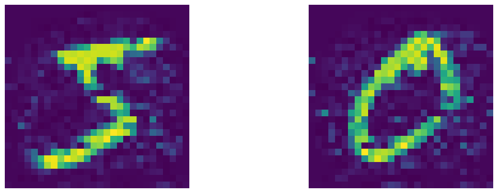
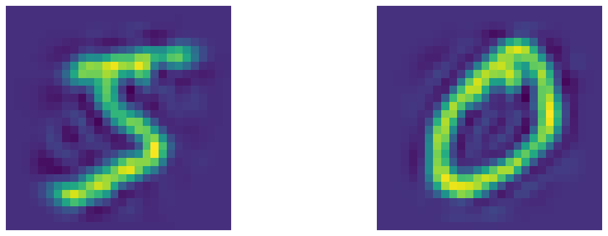
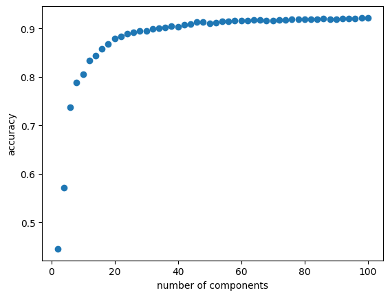

# Principal Component Analysis on MNIST

This notebook applies principal component analysis (PCA) to MNIST digits with NumPy and scikit-learn and measures how the compression affects classification. It first computes the eigenvalues and eigenvectors of the pixel covariance matrix, selects the components that explain 99.5% of the variance, and reconstructs training images from them. It then reconstructs the images with scikit-learn's `PCA` for every even number of components from 2 to 100 and trains a logistic regression classifier on each reconstruction. The test accuracy of these classifiers is compared with that of a classifier trained on the original pixels.

## Results

### Reconstruction
The hand-computed PCA keeps 361 of the 784 dimensions, a compression ratio of 2.17. Its reconstructions are noisy even with 361 components, because the code reorders the rows of the eigenvector matrix instead of its columns and therefore does not select the principal components. The scikit-learn reconstructions from 100 components are smoother.

#### Two original training digits

#### Reconstructions from the 361 hand-computed components

#### Reconstructions from 100 scikit-learn components

### Classification accuracy
The test accuracy rises quickly with the number of components, from about 0.44 with 2 components to about 0.88 with 20, and then levels off. The best accuracy, 92.20%, is reached with 100 components, the largest number tested, and the classifier trained on the original pixels reaches 92.60%. The test images are reconstructed with a PCA fitted to the test set itself rather than to the training set.

#### Test accuracy of logistic regression versus the number of PCA components

