# Variational Autoencoders: VAE, CVAE, and VQ-VAE on MNIST

This folder contains two PyTorch notebooks on variational autoencoders for MNIST digits. `VAE_CVAE.ipynb` trains a VAE and a conditional VAE (CVAE) with fully connected encoders and decoders, a 20-dimensional latent space, and a loss that adds a binary cross-entropy reconstruction term to the KL divergence from a standard normal prior; the CVAE also feeds the digit label to the encoder and the decoder. It shows images decoded from random latent vectors and plots the latent codes of both models directly and with t-SNE. `VQ_VAE.ipynb` trains a vector-quantized VAE with a convolutional encoder and decoder and a codebook of three 2-dimensional vectors, using the codebook and commitment losses and the straight-through estimator. It plots the training curves, reconstructions, and the codebook during training, and repeats the training on colored MNIST digits with different codebook sizes and dimensions.

## Results

### VAE and CVAE
Both models train for 10 epochs. The loss per training image falls from 156.25 to 102.95 for the VAE and from 149.55 to 98.72 for the CVAE. The VAE decodes random latent vectors into digit-like images, some of them blurred. The CVAE generates one image for each requested digit, and most match their labels, but the 3 and the 5 are hard to recognize. In the t-SNE projection, the VAE's latent codes form a separate cluster for each digit, while the CVAE's codes of different digits overlap, because the CVAE decoder receives the label and the latent code does not need to encode the digit.

#### VAE samples from random latent vectors, before the last epoch

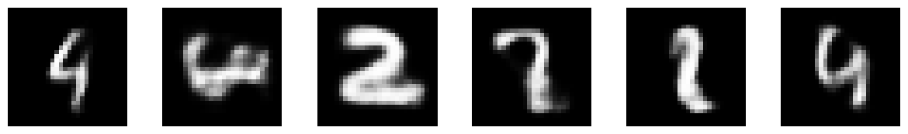

#### CVAE samples for digits 0 to 9, before the last epoch

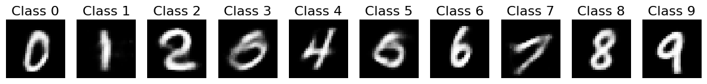

#### VAE latent codes: first two dimensions and t-SNE projection
Colors mark the digit labels.

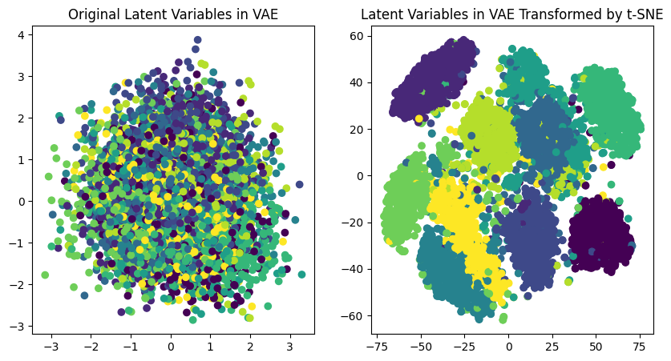

#### CVAE latent codes: first two dimensions and t-SNE projection
Colors mark the digit labels.

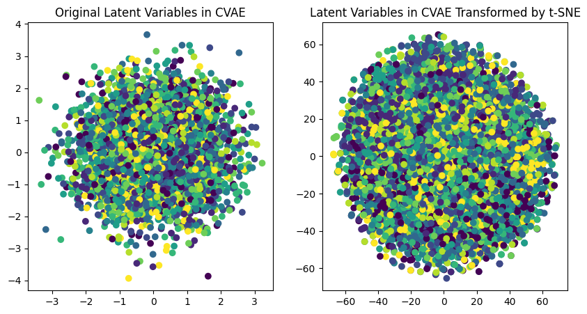

### VQ-VAE
After 20 epochs, the mean reconstruction error over the last 100 iterations is 0.08 and the loss is 0.34, and the reconstructed test digits are close to the originals. During training, the three codebook vectors move from near the origin to three separate positions.

#### VQ-VAE reconstruction error and loss during training
Both curves are smoothed with a Savitzky-Golay filter.

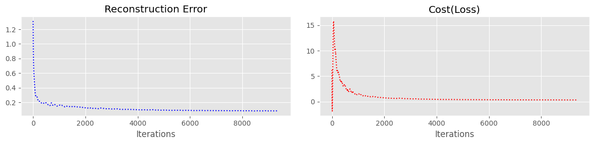

#### Test digits (top) and their VQ-VAE reconstructions (bottom)

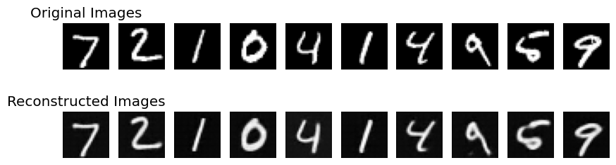

#### Codebook vectors during training

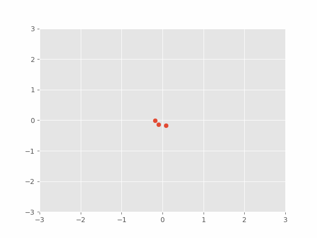

### Colored MNIST
The notebook prints no losses for these runs, so the comparison is visual. With 2 codebook vectors, several digits are blurred or change shape, such as the 1, which becomes a cross, and many colors differ from the originals; with 50 vectors, the shapes and most of the colors match the originals. With 3 codebook vectors, changing their dimension changes the colors of the reconstructions, and with dimension 50 the 3 is reconstructed as an 8.

#### Original colored digits

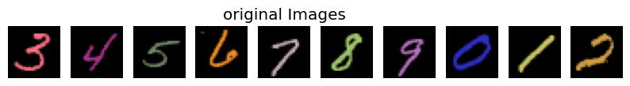

#### Reconstructions with 2 codebook vectors of dimension 2

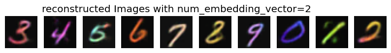

#### Reconstructions with 50 codebook vectors of dimension 2

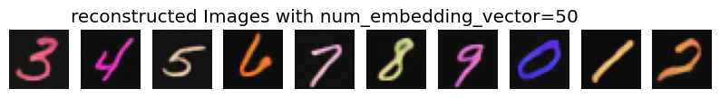

#### Reconstructions with 3 codebook vectors of dimension 50

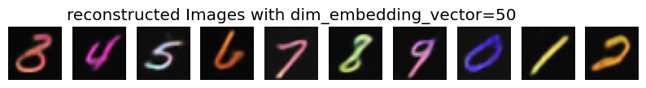

